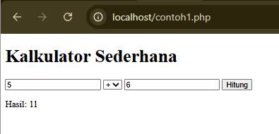
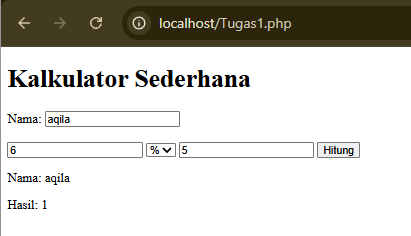
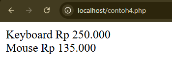
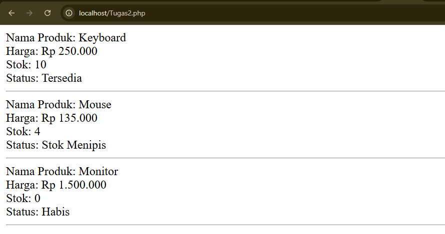

# Praktikum Pemrograman Berbasis Web - Pertemuan 1

Repository ini berisi hasil praktikum Pemrograman Berbasis Web Pertemuan 1, yang terdiri dari Tugas 1 (modifikasi program Kalkulator) dan Tugas 2 (modifikasi program Produk) menggunakan PHP.

## Identitas

| | |
|---|---|
| **Nama** | Raudha Hafsha Aqila |
| **NPM** | 4524210123 |
| **Program Studi** | Teknik Informatika |
| **Mata Kuliah** | Pemrograman Berbasis Web - B |

## Teknologi yang Digunakan

- PHP
- HTML
- XAMPP (Apache)
- Git & GitHub
- Visual Studio Code

## Struktur Repository

```text
.
├── contoh/
│   ├── contoh1-kalkulator.php
│   ├── contoh2-biodata.php
│   ├── contoh3-oop-mahasiswa.php
│   └── contoh4-produk.php
├── tugas1/
│   └── kalkulator.php
├── tugas2/
│   └── produk.php
├── screenshots/
│   ├── tugas1-sebelum.png
│   ├── tugas1-sesudah.png
│   ├── tugas2-sebelum.png
│   └── tugas2-sesudah.png
└── README.md
```

## Cara Menjalankan Program

1. Install dan buka **XAMPP**.
2. Jalankan **Apache** lewat XAMPP Control Panel dengan menekan tombol **Start**.
3. Clone repository ini ke dalam folder `htdocs`:
```bash
   git clone <url-repository>
```
4. Buka browser, lalu akses program lewat `localhost`, contoh:
```text
   http://localhost/nama-folder/tugas1/kalkulator.php
   http://localhost/nama-folder/tugas2/produk.php
```

## Daftar Contoh Program Pertemuan 1

Seluruh contoh program sudah dijalankan dan menghasilkan output tanpa error kritis.

| No | Contoh | Deskripsi |
|----|--------|-----------|
| 1 | Kalkulator | Kalkulator sederhana dengan form `POST`, mendukung penjumlahan, pengurangan, perkalian, pembagian, serta pencegahan pembagian dengan nol. |
| 2 | Biodata | Biodata mahasiswa dengan associative array (NIM, nama, program studi, semester, IPK) dan fungsi `statusKelulusan()`. |
| 3 | OOP Mahasiswa | Penerapan OOP dengan interface `Identitas`, class `Mahasiswa`, constructor, setter, getter, dan validasi IPK. |
| 4 | Produk | Penerapan interface, class, inheritance, dan method lewat class `Produk` dan `ProdukDiskon`. |

---

## Tugas 1 - Modifikasi Kalkulator

Tugas 1 menggunakan **Contoh 1 (Kalkulator)** sebagai dasar modifikasi.

### Modifikasi

**1. Menambahkan field nama (field baru)**
Form kalkulator ditambah input nama. Nama pengguna ditampilkan pada hasil perhitungan.

**2. Menambahkan operator persentase `%` (kondisi/fungsi baru)**
Operator `%` menghitung persentase angka pertama berdasarkan angka kedua. Contoh: angka pertama 100 dan angka kedua 25 menghasilkan 25.

### Lima Bagian Kode Penting

**1. Pemeriksaan request method**

```php
if ($_SERVER['REQUEST_METHOD'] === 'POST')
```

Memastikan proses kalkulator hanya berjalan ketika form dikirim dengan metode `POST`.

**2. Pengambilan data form**

```php
$nama = trim($_POST['nama'] ?? '');
$a = (float) ($_POST['a'] ?? 0);
$b = (float) ($_POST['b'] ?? 0);
$operator = $_POST['operator'] ?? '+';
```

Mengambil data dari form dan mengubah data angka menjadi tipe `float`.

**3. Percabangan `switch`**

```php
switch ($operator)
```

Menentukan operasi yang dijalankan berdasarkan operator yang dipilih pengguna.

**4. Operator persentase**

```php
case '%':
    $hasil = ($a * $b) / 100;
    break;
```

Bagian modifikasi untuk menghitung persentase.

**5. `htmlspecialchars()`**

```php
htmlspecialchars($nama)
```

Dipakai saat menampilkan input pengguna ke halaman HTML agar karakter khusus diproses dengan aman.

### Screenshot

**Sebelum modifikasi**



**Sesudah modifikasi**



### Error, Penyebab, dan Perbaikan

- **Error:** Perintah Git di terminal tidak dikenali.
```text
  git : The term 'git' is not recognized...
```
- **Penyebab:** Git belum terinstal atau belum terdaftar di PATH Windows.
- **Perbaikan:** Menginstal Git for Windows, membuka ulang terminal atau Visual Studio Code, lalu memastikan Git sudah dikenali:
```bash
  git --version
```

---

## Tugas 2 - Modifikasi Produk

Tugas 2 menggunakan **Contoh 4 (Produk)** sebagai dasar modifikasi.

### Modifikasi

**1. Menambahkan field `stok` (field baru)**
Class `Produk` sekarang menyimpan jumlah stok tiap produk.

```php
new Produk('Keyboard', 250000, 10)
```

Angka `10` menunjukkan jumlah stok produk.

**2. Menambahkan method `statusStok()` (kondisi baru)**

| Stok | Status |
|------|--------|
| 0 | Habis |
| 1 - 5 | Stok Menipis |
| Lebih dari 5 | Tersedia |

### Lima Bagian Kode Penting

**1. Interface `BisaDihitung`**

```php
interface BisaDihitung
{
    public function hargaAkhir(): float;
}
```

Menentukan method `hargaAkhir()` yang wajib dimiliki class yang mengimplementasikannya.

**2. Constructor `Produk`**

```php
public function __construct(
    protected string $nama,
    protected float $harga,
    protected int $stok
) {}
```

Menerima dan menyimpan nama produk, harga, dan stok. Field `stok` ditambahkan pada Tugas 2.

**3. Method `getStok()`**

```php
public function getStok(): int
{
    return $this->stok;
}
```

Mengambil nilai stok dari suatu produk.

**4. Method `statusStok()`**

```php
public function statusStok(): string
{
    if ($this->stok <= 0) {
        return 'Habis';
    }

    if ($this->stok <= 5) {
        return 'Stok Menipis';
    }

    return 'Tersedia';
}
```

Menentukan status stok berdasarkan jumlah stok yang tersedia.

**5. Class `ProdukDiskon`**

```php
class ProdukDiskon extends Produk
```

Class turunan dari `Produk` untuk produk yang memiliki harga setelah diskon.

### Screenshot

**Sebelum modifikasi**



**Sesudah modifikasi**



### Error, Penyebab, dan Perbaikan

- **Error:** File PHP tidak dapat diproses lewat browser.
- **Penyebab:** Apache pada XAMPP belum dijalankan, sehingga PHP tidak bisa diproses lewat `localhost`.
- **Perbaikan:**
  1. Buka XAMPP Control Panel.
  2. Klik **Start** pada Apache.
  3. Pastikan Apache berstatus aktif.
  4. Buka kembali program PHP lewat `localhost`.
  5. Jalankan ulang program untuk memastikan output tampil.

---

## Kesimpulan

Praktikum Pertemuan 1 telah dikerjakan dengan menjalankan seluruh contoh program dan memodifikasinya sesuai instruksi tugas. Pada Tugas 1, program kalkulator dimodifikasi dengan menambahkan field nama dan operator persentase. Pada Tugas 2, program produk dimodifikasi dengan menambahkan field stok dan kondisi status stok. Dokumentasi juga dilengkapi penjelasan lima bagian kode penting, screenshot sebelum dan sesudah modifikasi, serta penjelasan error, penyebab, dan perbaikannya.