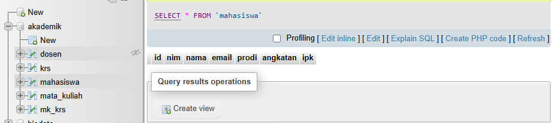
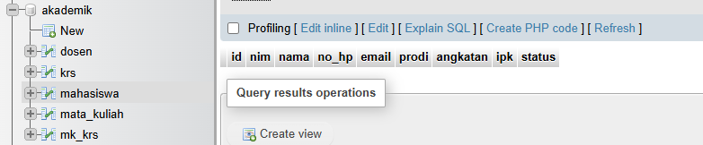

# Praktikum Pemrograman Berbasis Web - Pertemuan 3

Repository ini berisi hasil praktikum Pemrograman Berbasis Web Pertemuan 3, yang terdiri dari Tugas 1, Tugas 2, dan Tugas 3 menggunakan PHP dan MySQL.

## Identitas

|                   |                              |
| ----------------- | ---------------------------- |
| **Nama**          | Raudha Hafsha Aqila          |
| **NPM**           | 4524210123                   |
| **Program Studi** | Teknik Informatika           |
| **Mata Kuliah**   | Pemrograman Berbasis Web - B |

## Teknologi yang Digunakan

* PHP
* MySQL
* XAMPP (Apache & MySQL)
* Git & GitHub
* Visual Studio Code

---

# Tugas 3

Tugas 3 merupakan program PHP yang menggunakan database MySQL untuk membuat database `akademik` beserta beberapa tabel yang digunakan dalam sistem akademik.

Program membuat database `akademik` jika belum tersedia, kemudian membuat beberapa tabel yaitu `mahasiswa`, `dosen`, `mata_kuliah`, `krs`, dan `mk_krs`.

### Modifikasi yang Dilakukan

**1. Menambahkan field nomor handphone pada tabel mahasiswa**

Pada tabel `mahasiswa` ditambahkan field:

```sql
no_hp VARCHAR(15) NOT NULL

```

Modifikasi ini digunakan untuk menyimpan nomor handphone mahasiswa sehingga data mahasiswa menjadi lebih lengkap.

**2. Menambahkan field status mahasiswa**

Pada tabel `mahasiswa` ditambahkan field:

```sql
status ENUM('Aktif','Cuti','Lulus') DEFAULT 'Aktif'

```

Modifikasi ini digunakan untuk menyimpan status akademik mahasiswa. Status yang tersedia adalah **Aktif**, **Cuti**, dan **Lulus**. Jika status tidak diberikan, maka status mahasiswa secara otomatis menjadi **Aktif**.

## Lima Bagian Kode Penting Tugas 3

### 1. Membuat Database

```php
$sqlCreateDB = "CREATE DATABASE IF NOT EXISTS akademik";

```

Digunakan untuk membuat database `akademik`. Jika database sudah tersedia, program tidak akan membuat database baru.

### 2. Memilih Database

```php
mysqli_set_charset($koneksi, "utf8mb4");
mysqli_select_db($koneksi, 'akademik');

```

Digunakan untuk mengatur karakter yang digunakan oleh database dan memilih database `akademik`.

### 3. Membuat Tabel Mahasiswa

```sql
CREATE TABLE IF NOT EXISTS mahasiswa (
    id BIGINT UNSIGNED AUTO_INCREMENT PRIMARY KEY,
    nim VARCHAR(15) NOT NULL UNIQUE,
    nama VARCHAR(100) NOT NULL,
    no_hp VARCHAR(15) NOT NULL,
    email VARCHAR(120) NOT NULL UNIQUE,
    prodi VARCHAR(80) NOT NULL,
    angkatan YEAR NOT NULL,
    ipk DECIMAL (3,2) DEFAULT 0.00,
    status ENUM('Aktif','Cuti','Lulus') DEFAULT 'Aktif'
)

```

Digunakan untuk membuat tabel `mahasiswa` yang menyimpan data mahasiswa. Pada bagian ini terdapat dua modifikasi, yaitu penambahan `no_hp` dan `status`.

### 4. Membuat Relasi Foreign Key

```sql
CONSTRAINT fk_mk_dosen
FOREIGN KEY (dosen_id) REFERENCES dosen(id)
ON UPDATE CASCADE ON DELETE SET NULL

```

Digunakan untuk menghubungkan tabel `mata_kuliah` dengan tabel `dosen`.

### 5. Membuat Tabel Menggunakan Perulangan

```php
foreach ($sqlCreateTables as $namaTabel => $query) {
    if (mysqli_query($koneksi, $query)) {
        echo "Tabel berhasil dibuat atau sudah ada.\n";
    } else {
        echo "Gagal membuat tabel: "
        . mysqli_error($koneksi) . "\n";
    }
}

```

Digunakan untuk menjalankan seluruh query pembuatan tabel yang terdapat dalam array `$sqlCreateTables`.

## Screenshot Tugas 3

### Sebelum Modifikasi

Screenshot hasil program sebelum dilakukan modifikasi.



### Sesudah Modifikasi

Screenshot hasil program setelah dilakukan modifikasi.



```

---

# Error yang Pernah Muncul

### Error: `Could not open input file: tugas4`

Error muncul ketika menjalankan file PHP dengan nama yang mengandung tanda kurung, yaitu `tugas4(1).php`.

Perintah yang menyebabkan error:

```powershell
& "C:\xampp\php\php.exe" tugas4(1).php

```

Penyebabnya adalah nama file tidak ditulis sebagai satu nama file secara utuh.

### Perbaikan

Nama file ditulis menggunakan tanda petik:

```powershell
& "C:\xampp\php\php.exe" "tugas4(1).php"

```

Setelah nama file diberi tanda petik, program dapat dijalankan dengan benar.

---

# Kesimpulan

Pada praktikum Pertemuan 3, telah dilakukan implementasi program PHP yang terhubung dengan database MySQL. Tugas 1 membahas proses INSERT dan SELECT dengan kondisi tertentu, Tugas 2 membahas proses UPDATE, SELECT, GROUP BY, dan DELETE, sedangkan Tugas 3 membahas pembuatan database dan tabel beserta relasi antar tabel.

Selain menjalankan program asli, dilakukan beberapa modifikasi berupa penambahan kondisi program studi, status berdasarkan IPK, penambahan data mahasiswa, fitur untuk mencari mahasiswa dengan IPK tertinggi, penambahan nomor handphone, serta penambahan status akademik mahasiswa. Modifikasi tersebut membuat program memiliki fungsi tambahan dan memberikan hasil yang lebih informatif.
